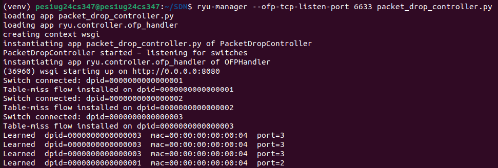
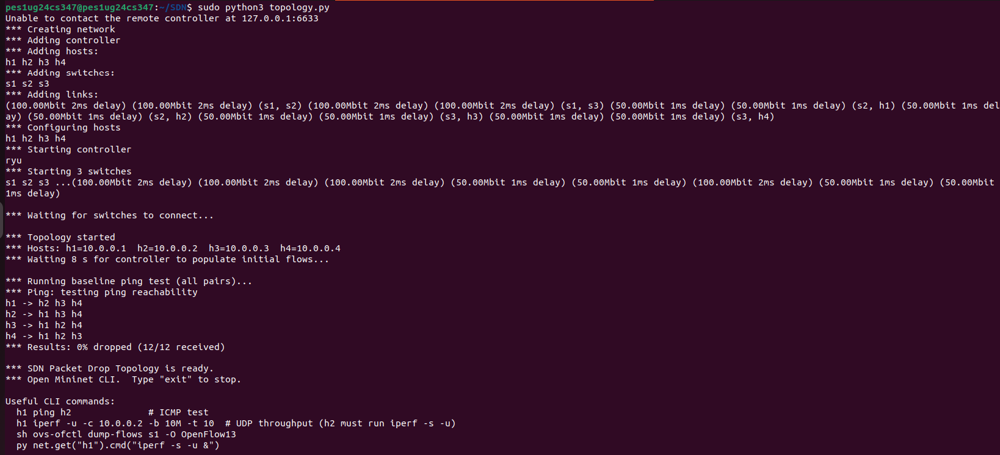
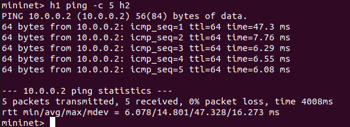
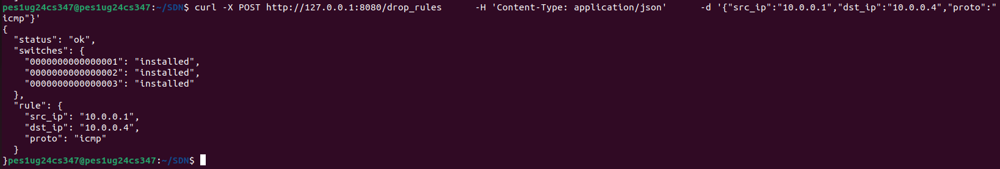
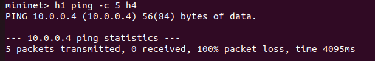
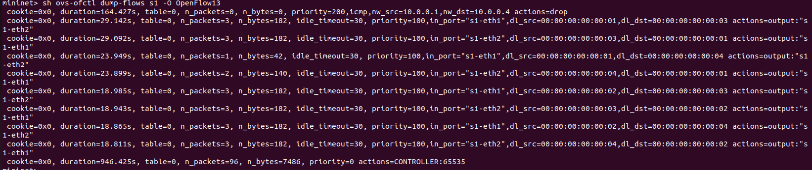
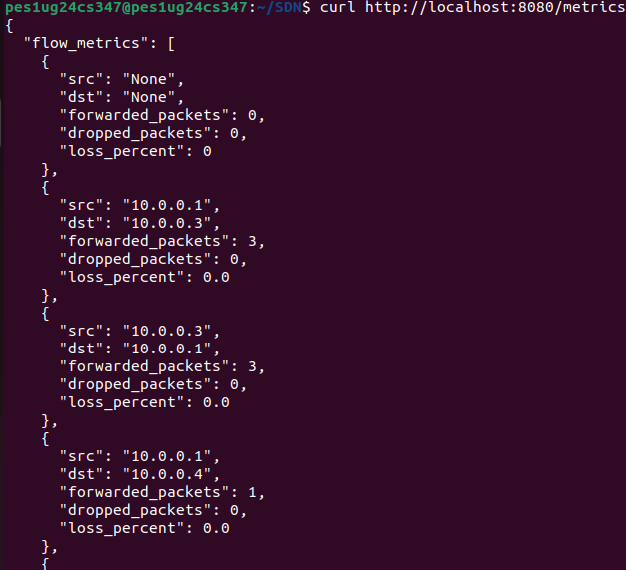
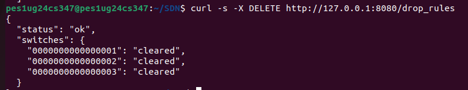
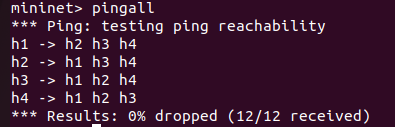
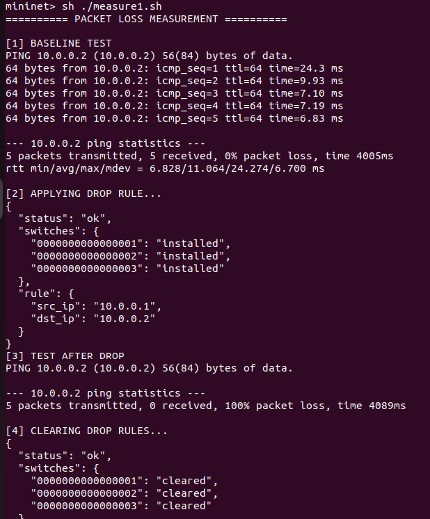

# SDN Packet Drop Simulator using Mininet and Ryu

## Problem Statement

This project implements a Software Defined Networking (SDN) solution using **Mininet** and a **Ryu OpenFlow controller** to simulate and analyze packet dropping behavior between hosts.

The objective is to demonstrate:
- Controller–switch interaction
- Flow rule design (match–action)
- Network behavior observation under different conditions

As required in the assignment :contentReference[oaicite:1]{index=1}, the system showcases forwarding, filtering, monitoring, and performance analysis.

---

## Project Overview

The system consists of:
- A **Mininet topology** (tree topology with 4 hosts, 3 switches)
- A **Ryu controller** implementing:
  - Learning switch behavior
  - Selective packet drop rules
  - REST APIs for control and monitoring
- A **measurement script** for packet loss evaluation

---

## Network Topology
     [Controller]
          |
        [s1]
       /     \
    [s2]     [s3]
    / \       / \
  h1   h2    h3   h4

  
- Hosts: h1–h4 (10.0.0.1 – 10.0.0.4)
- Switches: OpenFlow 1.3
- Controller: Ryu (remote)

---

## Features Implemented

### 1. Learning Switch (Forwarding)
- MAC learning using `packet_in`
- Dynamic flow installation
- Reduces controller overhead

### 2. Packet Drop Simulation
- Selective drop rules using OpenFlow
- Match fields:
  - IP (src/dst)
  - MAC (optional)
  - Protocol (TCP/UDP/ICMP)

### 3. REST APIs
| Endpoint | Description |
|--------|------------|
| POST /drop_rules | Install drop rule |
| DELETE /drop_rules | Remove drop rules |
| GET /event_log | View packet logs |
| GET /metrics | Per-flow packet loss |

### 4. Per-Flow Packet Loss Measurement
- Uses OpenFlow flow statistics
- Computes: loss % = dropped / (dropped + forwarded)
- Provides structured output per connection

### 5. Event Logging
- Logs all packet_in events
- Includes MAC, IP, timestamp

---

## Workflow

### Step 1: Start Controller 
ryu-manager packet_drop_controller.py

### Step 2: Start Mininet
sudo python3 topology.py

### Step 3: Baseline Test
mininet> pingall

### Step 4: Apply Drop Rule
curl -X POST http://localhost:8080/drop_rules
-d '{"src_ip":"10.0.0.1","dst_ip":"10.0.0.2"}'

### Step 5: Test Packet Loss
mininet> h1 ping h2

### Step 6: Measure Metrics
curl http://localhost:8080/metrics

---

## Output

Running RYU controller : 

Running Toplogy.py :

Base connectivity:

Applying Drop rule:

After Applying Drop Rule:

Flow tables:

Metrics :

Clearring the drop rules

After clearing drop rules:

Auntomated measurement script

## Test Scenarios
🔹 Scenario 1: Normal Operation
No drop rules
Expected: 0% packet loss
🔹 Scenario 2: Packet Drop
Drop rule applied
Expected: 100% packet loss
🔹 Scenario 3: Recovery
Drop rules removed
Expected: Network restored

## Regression Testing

The system verifies:

Drop rules are correctly installed
Drop rules are removed precisely
Forwarding rules remain unaffected

Apply drop → Verify loss → Remove drop → Verify recovery

## Key Design Decisions
Reactive learning switch (simpler + realistic SDN)
Priority-based rule control:
Drop: 200
Forward: 100
REST-based control for flexibility
Flow stats used for analytics

## Challenges Faced
Flow matching conflicts (MAC vs IP)
Drop rules not triggering due to existing flows
OpenFlow counters not updating for drop rules
Synchronization delays in stats collection

## Technologies Used
Python 3
Ryu Controller
Mininet
OpenFlow 1.3
cURL (API testing)

## Project Structure
SDN/
├── packet_drop_controller.py
├── topology.py
├── measure1.sh
├── README.md
📸 Proof of Execution

## Conclusion

This project successfully demonstrates:

SDN-based traffic control
Flow rule design and enforcement
Real-time packet loss analysis
Automated evaluation and validation

## References
Ryu Documentation
Mininet Documentation
OpenFlow Specification

---
